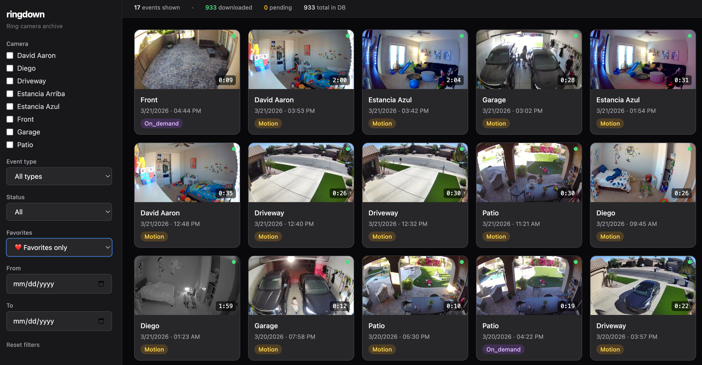

# ringdown

A CLI tool to automatically download Ring camera videos to your local machine — with a local web UI to browse, filter, and watch them in the browser. Run it whenever you want; it tracks what's already been downloaded and only pulls what's new.



## Features

- Authenticates with Ring using OAuth (with 2FA support)
- Syncs your event history (motion, dings, on-demand) to a local SQLite database
- Downloads only new videos — skips anything already saved
- Organizes files by device and date: `{outputDir}/{device}/{YYYY-MM-DD}/{event_id}.mp4`
- Works across all your Ring cameras and doorbells
- **Web UI** — browse, filter by one or more cameras, and play videos in the browser via `ringdown serve`
- **Thumbnails** — auto-generated via ffmpeg after each download, shown in the web UI

## Requirements

- Node.js 22+
- [ffmpeg](https://ffmpeg.org/) — for thumbnail generation (`brew install ffmpeg`)
- A Ring account

## Installation

```bash
git clone https://github.com/yourusername/ringdown.git
cd ringdown
npm install
npm run build
npm link        # makes `ringdown` available globally
```

## Usage

### First-time setup

```bash
ringdown auth
```

Prompts for your Ring email, password, and 2FA code. Saves a refresh token to `~/.ringdown/token.json` — you won't need to log in again unless your token expires.

### Pull new videos

```bash
ringdown pull
```

The main command. Syncs your event history from Ring, then downloads anything not yet saved locally. Run this whenever you want to update your local archive.

### Browse videos in the browser

```bash
ringdown serve
```

Starts a local web server at `http://localhost:3000` with a video browser. Filter by one or more cameras, date range, and event type (motion/ding). Click any event to watch the video inline. Keeps running until you press `Ctrl+C`.

```bash
ringdown serve --port 8080   # Use a different port
```

### Individual commands

```bash
ringdown sync        # Fetch new events from Ring into the local database
ringdown download    # Download all events not yet saved to disk
ringdown thumbnails  # Generate thumbnails for downloaded videos (requires ffmpeg)
ringdown status      # Show counts: synced, downloaded, pending
ringdown list        # List recent events with download status
ringdown ls-devices  # List all Ring devices on your account
```

### Options

```bash
ringdown pull --days 7               # Only look back 7 days (default: 30)
ringdown pull --device "Front Door"  # Only pull from a specific device
ringdown download --concurrency 3    # Download 3 videos at a time (default: 2)
```

## Configuration

Config is stored at `~/.ringdown/config.json`. Set up during `ringdown auth` or edit directly.

```json
{
  "outputDir": "~/Videos/Ring",
  "lookbackDays": 30,
  "concurrency": 2
}
```

| Key | Default | Description |
|-----|---------|-------------|
| `outputDir` | `~/Videos/Ring` | Where to save downloaded videos |
| `lookbackDays` | `30` | How many days of history to sync |
| `concurrency` | `2` | Parallel downloads |

## File Organization

Videos are saved as:

```
{outputDir}/
├── Front Door/
│   └── 2026-03-21/
│       ├── abc123.mp4
│       └── def456.mp4
└── Backyard Cam/
    └── 2026-03-20/
        └── ghi789.mp4
```

## Database

ringdown maintains a local SQLite database at `~/.ringdown/ringdown.db` with every event it has ever seen. This is how it knows what to skip on future runs.

You can open it in any SQLite-compatible tool — JetBrains IDEs (WebStorm, IntelliJ, etc.) have a built-in Database panel that works great with it.

Or query it directly:

```bash
sqlite3 ~/.ringdown/ringdown.db \
  "SELECT device_name, kind, datetime(created_at, 'unixepoch') FROM events ORDER BY created_at DESC LIMIT 20;"
```

## How it works

1. `sync` calls the Ring API and fetches your event history for the configured lookback window, upserting each event into the local DB (`ON CONFLICT DO NOTHING` — fully idempotent).
2. `download` queries the DB for events where `downloaded = 0`, requests a signed video URL from Ring for each, downloads the MP4, and marks it as downloaded.
3. `download` also runs ffmpeg after each successful download to extract a frame at 1 second as a JPEG thumbnail, stored in `~/.ringdown/thumbnails/`. Run `ringdown thumbnails` at any time to backfill missing ones.
4. `serve` starts a Fastify server that exposes a REST API over the SQLite DB and streams video files with HTTP range request support so they seek and play correctly in the browser.
5. Token refresh is handled automatically — Ring sessions stay alive without re-authenticating.

## Notes

- This uses the unofficial Ring API via [`ring-client-api`](https://github.com/dgreif/ring). It's not an official Ring product.
- Ring only keeps videos for a limited time (typically 60 days for non-subscribers, 180 days for Protect subscribers). Run `ringdown pull` regularly to avoid missing events.
- Downloaded videos are yours to keep indefinitely.
- Everything runs locally — no accounts, no cloud, no data leaves your machine.

## License

MIT
